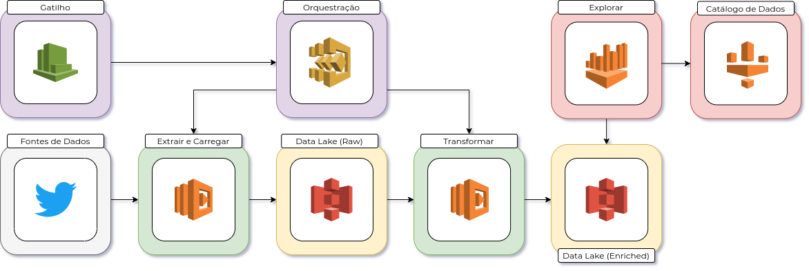

# Twitter Data Lake

## 1. Getting Started

Source code for the **Twitter Data Pipeline** built on AWS cloud:

- **ELT** with AWS Lambda;
- **Data Lake** with AWS s3;
- **Orchestration** with AWS Step Functions and AWS CloudWatch;
- **Exploratory Analysis** with AWS Athena and AWS GLue.

## 2. Built With

* **[Amazon Web Services](https://aws.amazon.com/)** - On-demand cloud computing platform.

## 3. Authors

* **Andre Perez** - **[twitter](https://twitter.com/dekoperez)** - **[email](mailto:andre.marcos.perez@gmail.com)**

## 4. Architecture

